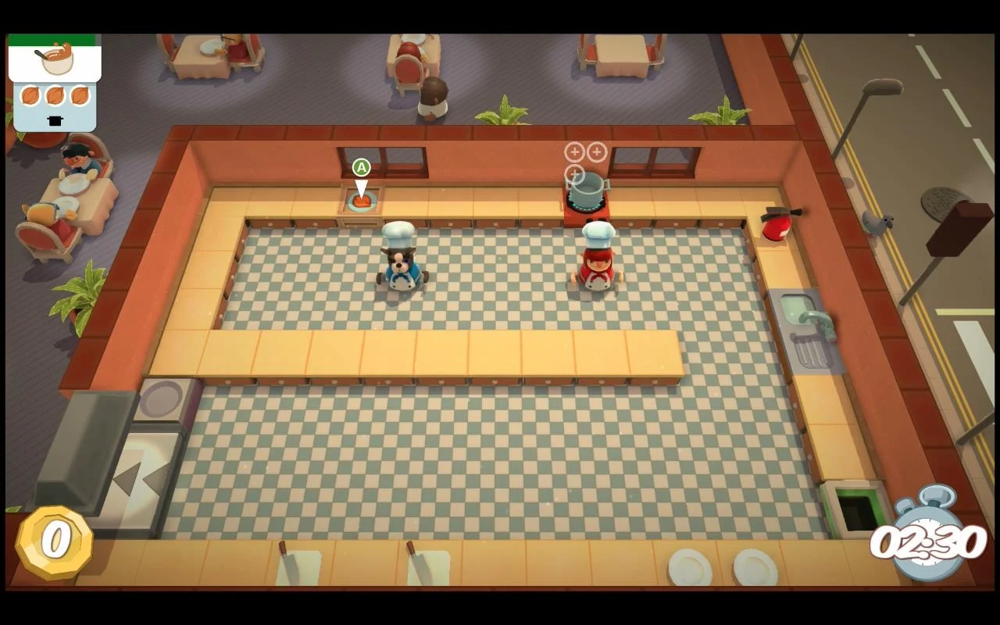

# Game Breakdown of _Overcooked!_

## Quick facts

- Genre: Multiplayer cooperative party game.
- Camera: Adopts a pseudo top-down view.
- Map: Grid-based, but the players could move freely.
- Goal: To cook and serve as many orders as possible within limited time.

## Take a closer look

Below is an image of Level 1-1 of _Overcooked!_

The scene resembles the kitchen of a restaurant well, so the player could know at first glance that they are playing a game about cooking.

> Why is there no door in this kitchen...?

It can be clearly seen that the map is divided into tiles, with each tile either being empty, a desk, or some other facilities.
There are two characters in the map, playing the role of the chefs of the kitchen, each controlled by one player.

On the bottom-right corner there's a watch, indicating how much time is left for this level.
At the end of each level, the game will give a grading on what the players have done and how well they have done.

On the top-left corner there are orders from the customers, each requiring a dish to be made and served.
There are some important information shown in an order paper:

- The type of the dish. (Salad/soup/burger/etc.)
- What ingredients are needed.
- What cookeries are needed for cooking the dish.
- How much time is left for this dish to be served.

So the dishes need to be served within a relatively short time range, compared to the total level time.

For level 1-1, there is only one type of dish with one single ingredient needed to be served: onion soup, as the level is meant to be a tutorial-like first level.
It's relatively simple to cook onion soup (all steps are labeled in the image):

1. Take the onions out from the basket.
2. Take them to the cutting board and cut them.
3. Put the cut onion into the pot.
4. Set the pot on stove and wait for it to be cooked.
5. Pour the soup into the plate before the pot's burnt.
6. Take the plate to the serving table.
7. Collect the dirty dishes from the recycling window to the sink.
8. Wash them in the sink and put them back on empty desks.
9. If anything goes wrong, there's a bin to dispose unwanted items or burnt soup.

It's easy to see that if players really follow through all the steps, they would be taking unnecessarily long routes all the time.
So, instead of each chef does all the steps individually, an obviously more reasonable strategy is to split the work up by each chef taking the works on one side of the kitchen (divided by the line of desks in the middle horizontally), so that neither one needs to walk long distances anymore.

A possible working plan would be like:
Chef A is in charge of taking the ingredients, putting cut ingredients in pots, getting them cooked and passing cooked soups to over the desks;
while chef B is in charge of cutting ingredients passed by chef A, passing them back, taking the cooked soup to the dishes, returning the pot, serving the dishes and cleaning the returned dirty dishes.

## What makes the game fun?

In this section, I will describe my subjective feeling towards the game and try to analyse what makes me feel fun.

First of all, it's the _flow_.
Because of the timing limitation and the working procedure, I had to split my mind to keep an eye on everything though out the level, including:

- The order contents.
- The remaining order time.
- Keep analysing what is the most urgent need. (This is the most heavy thinking task)
- The cooking pots' progresses (or they'd be burnt).
- Don't forget to clean the used dishes, or there would be no usable clean dish.

This is very intense;
but for each order done, it creates a little feeling of achieving.
So the flow really got me hooked in there.

Secondly, due to the map design of each level, it's common for me & my friends to mess it up for the first few tries, until we find the optimal route intended by the level designer.
It's a process of accumulating desiring level.
As I was impeded by the map design each time, I would gain more insight;
I could constantly stop and think about what might be wrong in our current stragety, and what could be changed and optimized.
This puzzle solving experience is another thing I like about the game,
and it's an even higher level of the game cycle, a level above direct task-finishing within just one level.

> Although sometimes I got stuck too hard so I rage quit.

## What creates challenges?

The time limitation leads to lack of thorough planning, which leads to conflicts, which leads to tension.
When I said conflict, I meant three aspects: temporal, spatial and strategical.

### Temporal

Temporal challenge is the most founding element for the game play.
Without this, the whole game mechanism doesn't stand anymore, as the player could just walk around and do everything at an easy pace.

From outside, there are limitations for the entire level and each order, pushing the players to find the fastest way to finish the orders.
From inside, each step in the cooking procedure would cost fixed amount of time, as long as the necessary walkings.

### Spatial

Spatial challenge isn't only reflected on the map, but also fixed-amount resources, like desk space, usable clean disks, pots, chopping boards, etc.
The players must plan the usage of these resources wisely or otherwise they'd quickly be short on them, dragging down the entire cooking procedure.
This could be fatal because each cooking step are linked with one another, and the clock is still running when the procedure is stuck.

Also, the route planning thing mentioned earlier.
The level designer intentionally designed the map to be inconvenient for one chef to take care of the entire procedure, so it's necessary for multiple chefs to split the work.
There could be other spatial tricks like a narrow passageway where only one chef could pass at a time; or conveyer belts which would move objects around.

### Strategical

There's a strategy often used in real gameplay: batching.
Instead of doing orders one by one, it could save some time if the same steps are batched together.
It also saves some mental stress because the chef in charge of using the pots doesn't have to take care of them as frequently as if each pot is used individually—they work in sync now.

Now let's make a table to inspect each action and see what part of the gameplay they'd affect.

| Action | Spatial | Temporal |
| - | - | - |
| Taking ingredients | Desk\* | Instant |
| Cutting the ingredients | Cutting board | Occupational |
| Cooking | Pot | Non-occupational\*\* |
| Plating | Clean disk, desk | Instant |
| Serving | None | Instant |
| Dish-washing | None | Occupational |

> Since walking is always required, it's not explicitly written out.
>
> "Occupational" means an action requires the chef to stay in place, while "non-occupational" means the chef could walk around while it's progressing on its own.
>
> \* It's also possible to just drop the ingredients on the floor.
>
> \*\* The chef needs to constantly check the progress or they'd be burnt if forgotten for too long.

## MDA Analysis

In this section, I will list out the main aesthetics which I think make up the "essence" of this game, along with my personal opinion on whether they are abandonable for our prototype.

| Aesthetics | Dynamics | Mechanics | Abandonable |
| - | - | - | - |
| Immersive | The players feel like they're working in a kitchen. | Delicate map designs & art work. | Yes |
| Cooperating | The players need to cooperate well with other players to achieve success. | EVERYTHING. | Probably\* |
| Hurrying | The players need to rush on every actions. | Time limitation on each order; each action takes time. | No |
| Limited resources | The players often limited by the fixed resources (dishes, pots, etc.) so the procedure is stuck. | These resources are either occupable (only available for one task at a time) or usable (after being used it needs to be manually restored). | No |
| Spatially strategical | The players need to plan for the optimal work distribution, walking routes and resource placement. | Level design. | Probably\*\* |
| Temporarily strategical | The players could batch some stages, or do something in advance to prevent future insufficientness. | This is possible only because orders could queue up instead of coming in one by one, so that the players could plan ahead. | No |

> \* It could be hard if we were to make a multiplayer digital game.
> So many development-side troubles.
>
> \*\* Depending on what kind of prototype we are making.
> If we're making a paper or a first-person single player digital prototype then it's not needed.

## My idea

I really think that the kitchen settings is not important for the "essence" of this game.
It could be any job that has multiple stages and could queue up, and that the stages would conflict on occupying resources.

To give an example, a civil servant working at the front desk in a government facility would work for this case.
There are citizens coming in and queueing up;
the player could be playing the role of the civil servant, whose job is to get the citizens' business done.

For each citizen in the queue, there is a patience bar on their head, so the player needs to flush the waiting queue before they run out of patience.
But the player doesn't need to finish their business in order, instead they could let the citizens wait in a waiting zone after registering their business, then a new, longer waiting bar would replace the original patience bar.

After a business is registered, its details would then be displayed in the UI as in _Overcooked!_.
The player would then need to dispatch the works to different departments/office desks and wait for them to get the works done, finally collect the results and hand them back to the citizens.
But each department/office desk could only handle one work at a time, so it recreates the difficulties & strategies in the original game.